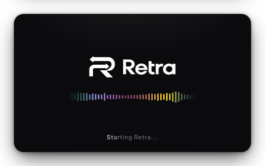

  
  <h1>Retra</h1>
  

    <b>Instant replay for Windows, with every app on its own audio track.</b> 
    Game on one track, Discord on another, Spotify on a third, your mic on its own: clips ready to edit, in sync.
  

  

    
    
    
    
  

  

> [!WARNING]
> Retra is an early preview: expect rough edges. This repository holds only the builds and the updates; the source
> code is not public.

## What it does

- **Instant replay**: the last 5 s to 20 min are always kept, and one hotkey saves them (`Alt+F10`). Turn desktop
  capture off and the buffer runs only while a game is open.
- **1 to 12 audio tracks**, each holding any mix of apps: drag them on. Every clip has one named audio stream per
  track, ready for Premiere, DaVinci Resolve or any editor.
- **Your microphone of choice**, switched live without losing the replay.
- **Quick panel over the game** (`Alt+X`): gallery, record, replay, screenshot, per-track volume and every setting.
- **Clips**: a player with all the tracks mixed in sync, trimming in several pieces with undo.
- **Hardware encoding** on NVIDIA, AMD or Intel GPUs, in H.264, HEVC or AV1; MP4 or MKV.
- Clips go in a folder per game, named after the game you're playing.
- Updates itself.

## A look around

<table>
  <tr>
    <td width="50%"></td>
    <td width="50%"></td>
  </tr>
  <tr>
    <td><b>Tracks in rows</b>, or as a mixing desk: meters, fader in dB, mute, and the apps on each track.</td>
    <td><b>Settings</b> at a glance: every card shows what it holds, the switches work from there.</td>
  </tr>
  <tr>
    <td></td>
    <td></td>
  </tr>
  <tr>
    <td><b>Quick panel</b> over the game, <code>Alt+X</code>.</td>
    <td><b>Launch screen</b>, animated while the portable unpacks.</td>
  </tr>
</table>

## Download

Grab the latest build from **[Releases](https://github.com/Fialsss/retra-releases/releases/latest)**:

- `Retra-x.y.z-Setup.exe`: installer, with Start menu and desktop shortcuts
- `Retra-x.y.z-Portable.exe`: a single file, no installation

Both update themselves: when a new version is out, a green button shows up at the top right of the window.
Windows 10/11 64-bit, with an NVIDIA, AMD or Intel GPU.

The builds are not code-signed yet, so Windows SmartScreen may show *"Windows protected your PC"* the first time.
Click **More info → Run anyway**.

## Support

Retra is made by one person in their spare time. If it saves your clips, you can
**[buy me a coffee on Ko-fi](https://ko-fi.com/fialss)**.

## Third-party

Retra ships FFmpeg (the LGPL 2.1 build by BtbN) as a separate, unmodified program. See [THIRD_PARTY.md](THIRD_PARTY.md).
