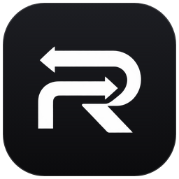
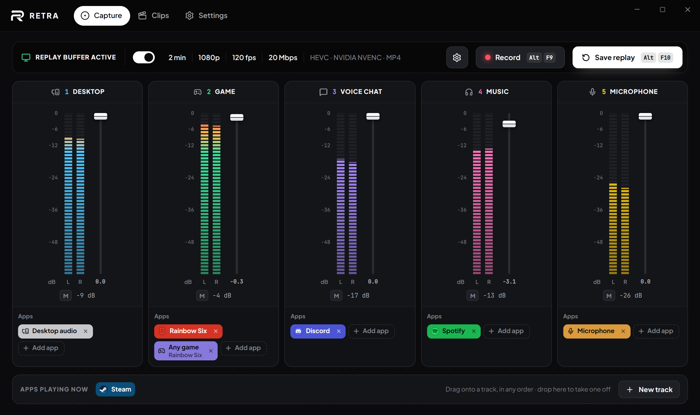
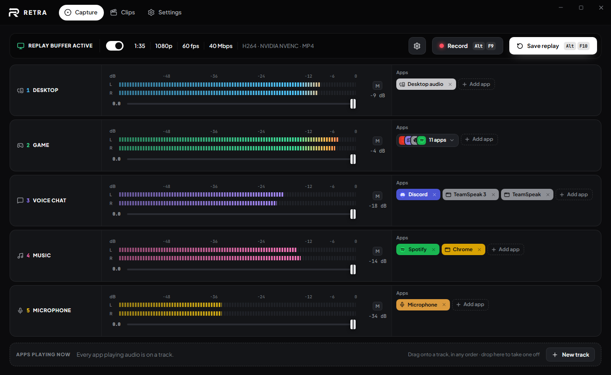
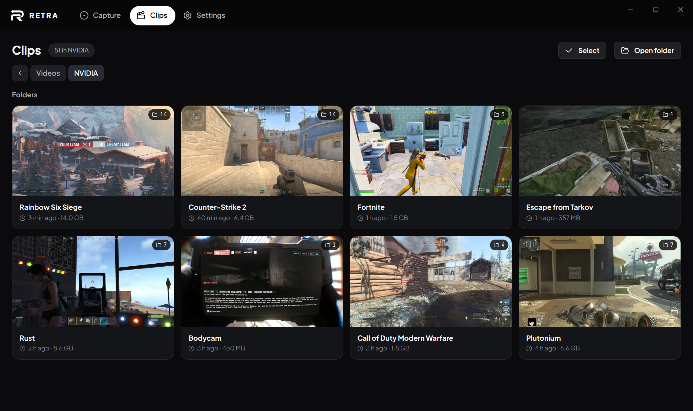
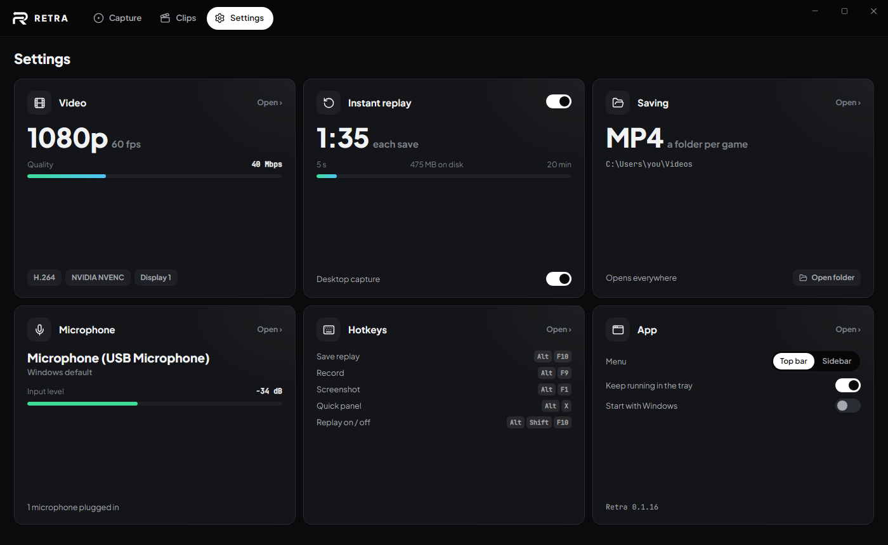
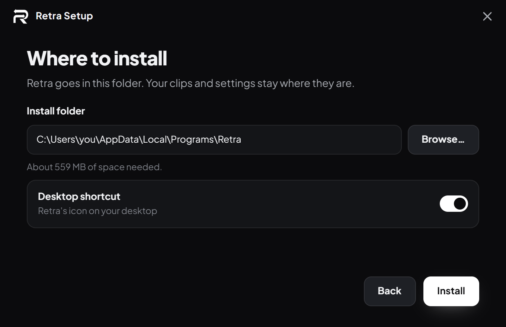
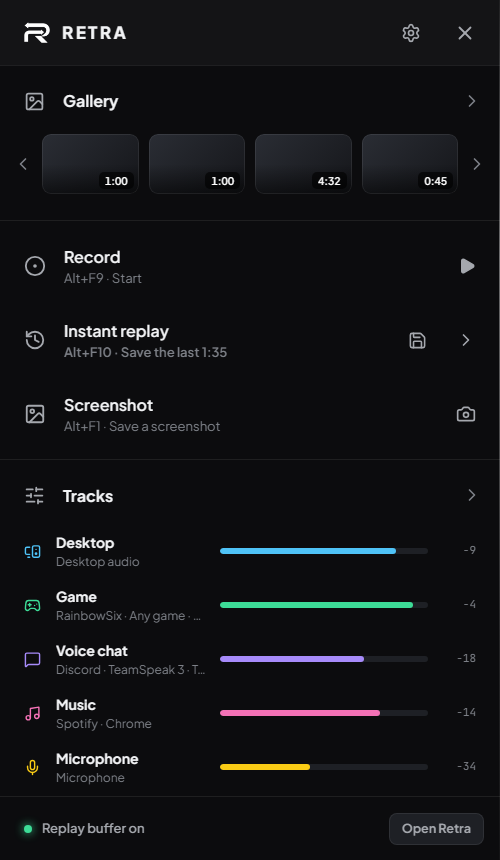

  
  <h1>Retra</h1>
  

    <b>Instant replay for Windows, with every app on its own audio track.</b> 
    Game on one track, Discord on another, Spotify on a third, your mic on its own: clips ready to edit, in sync.
  

  

    
    
    
    
  

  

> [!WARNING]
> Retra is an early preview: expect rough edges. This repository holds only the builds and the updates; the source
> code is not public.

## What it does

- **Instant replay**: the last 5 s to 20 min are always kept, and one hotkey saves them (`Alt+F10`). Turn desktop
  capture off and the buffer runs only while a game is open.
- **Smooth clips at 60 or 120 fps**, following your screen: 120 on a 120 Hz+ display, 60 on a 60 Hz one.
- **Every display at once** if you like, each recording on its own; a save takes the one your mouse is on.
- **1 to 12 audio tracks**, each holding any mix of apps: drag them on, name them, pick their icon. Every clip has
  one named audio stream per track, ready for Premiere, DaVinci Resolve or any editor, and tracks that stayed
  silent aren't in the file at all. The Desktop track holds everything, what your PC plays and your mic, for when
  you just want it all in one.
- **Your microphone, cleaned up live**: noise suppression, gate, EQ, compressor and your own VST3 plugins, already
  in the replay.
- **Quick panel over the game** (`Alt+X`): gallery, record, replay, screenshot, per-track volume and every setting.
- **Clips**: every video in your Videos folder, ShadowPlay's and OBS's too, browsed by folder. Play them with all
  the tracks in sync (Desktop or the separate tracks, never both, so nothing plays twice), turn each track down,
  trim them in several pieces, drop tracks, delete several at once.
- **Hardware encoding** on NVIDIA, AMD or Intel GPUs, in H.264, HEVC or AV1; MP4 or MKV.
- Clips go in a folder per game, named after the game you're playing.
- Updates itself, or checks right away from Settings.

## A look around

<table>
  <tr>
    <td width="50%"></td>
    <td width="50%"></td>
  </tr>
  <tr>
    <td><b>Tracks in rows</b>, or as a mixing desk: meters, fader in dB, mute, and the apps on each track.</td>
    <td><b>Clips</b>: your Videos folder by folder, a folder per game, with how much space each takes.</td>
  </tr>
  <tr>
    <td></td>
    <td></td>
  </tr>
  <tr>
    <td><b>Settings</b> at a glance: every card shows what it holds, the switches work from there.</td>
    <td><b>The installer</b>: pick the folder, and that's it.</td>
  </tr>
</table>

   
  <b>Quick panel</b> over the game, <code>Alt+X</code>.

## Download

Grab **`Retra-x.y.z-Setup.exe`** from **[Releases](https://github.com/Fialsss/retra-releases/releases/latest)**:
choose where to install it, and Retra is in your Start menu (and on your desktop, if you want).

It updates itself: when a new version is out, a green button shows up at the top right of the window, or
**Settings › App › Check now** looks right away. Windows 10/11 64-bit, with an NVIDIA, AMD or Intel GPU.

Had the portable (0.1.32 or before)? From 0.1.33 there's only the installer: install it once, your settings and
clips carry over.

The builds are not code-signed yet, so Windows SmartScreen may show *"Windows protected your PC"* the first time.
Click **More info → Run anyway**.

## Support

Retra is made by one person in their spare time. If it saves your clips, you can
**[buy me a coffee on Ko-fi](https://ko-fi.com/fialss)**.

## Third-party

Retra ships FFmpeg (the LGPL 2.1 build by BtbN) as a separate, unmodified program, and includes RNNoise, the VST 3 SDK and the WebView2 SDK loader. See [THIRD_PARTY.md](THIRD_PARTY.md).
